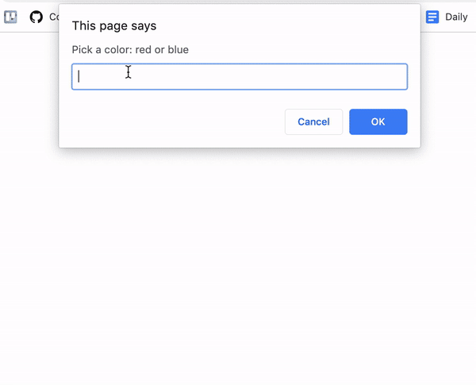

# example.fortune-teller
Example of how you can improve "Fortune Teller" by changing your alerts to actually edit the HTML file!




### Steps to help
- First, you'll need to add jQuery to your HTML file. Inside the `<head>` tag of your HTML file and above your script.js link, add this code: 
  ```
    <script type="text/javascript" src='https://cdnjs.cloudflare.com/ajax/libs/jquery/3.4.1/jquery.min.js'></script>
  ```
- After the prompt: 
  - Add an HTML element (maybe an `<h2>`) with an ID on it to your HTML page. This is where you'll put the user's fortune!
  - Look at the jQuery `.text()` function to replace text on the HTML page. Link [here](https://www.w3schools.com/jquery/html_text.asp)
  - Change your alerts to use the jQuery `.text()` function, and replace the text inside the `<h2>` you made!
